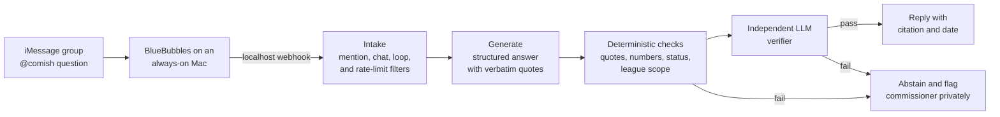

# Comish

[](https://github.com/EZ8EZ/comish/actions/workflows/ci.yml)


**The league's memory, with receipts.** Comish is a self-hosted assistant for dynasty fantasy league group chats. Mention `@comish` in iMessage and it answers rules and policy questions. Every answer quotes its source and the source's date. If it can't prove an answer, it stays quiet and sends the question to the commissioner.

```
@comish can I trade a taxi squad player during the season?

Taxi squad players can only be traded in the offseason.
Source: League Constitution §4.2 (eff. 2025-02-01): "Taxi squad players may only
be traded between the championship and the rookie draft."
```

```
@comish is this trade collusion?

I can't confirm this from league records. Flagging for the commissioner.
```

---

## Why

Dynasty leagues run for years. Rule changes get voted on, one-off rulings pile up, and league policies go beyond what the Sleeper app enforces. Nobody remembers what was decided, so the commissioner answers the same questions again and again.

A wrong answer can lead a manager to make a trade or roster move they can't undo. So Comish is built around one rule: **cite or abstain.**

## How it works



**Knowledge sources, per league:**

| Source | How it is used |
|---|---|
| Google Drive rules docs (Docs, PDFs) | Split into sections. Each section keeps its document name, section path and effective date. |
| Screenshots of votes and polls | Transcribed twice by a vision model. Nothing is citable until the commissioner approves it. |
| Commissioner rulings | Recorded by replying to a flagged question. The league's memory grows with every ruling. |
| Sleeper league settings | The source of truth for anything the app enforces: roster slots, scoring, waivers, trade deadline. Seasons are linked through `previous_league_id`. |

**Which source wins:** Sleeper settings win for anything the app enforces. For everything else, a later vote or ruling supersedes an earlier doc, but only when the link between them is explicit. If sources conflict, are undated, or may be superseded, Comish abstains.

## Safety model

- **Cite or abstain.** An answer ships only if every claim quotes an approved record word for word.
- **Deterministic gates.** Code checks every quote as an exact substring. Every number and date in the answer must appear in a cited quote. Superseded, pending and other-league records are rejected. These checks can reject an answer but never approve one.
- **Independent verifier.** A second model looks for any reason the answer could be wrong, outdated, incomplete or a judgment call.
- **Errors abstain.** Timeouts, quota limits and malformed model output all result in the abstain message, never a guess.
- **League isolation.** Each league has its own SQLite database and pipeline instance. Nothing is shared between leagues.
- **Privacy.** Messages that don't mention `@comish` are never stored or sent anywhere. Only their GUID and the reason they were ignored are logged.
- **Account safety.** A dedicated Apple ID, reply-only behavior, and hard per-sender and daily outbound caps.
- **Measured, not assumed.** An eval harness with real and adversarial questions gates every release. The key metric is the false-answer rate, and the target is zero.

## Status

| Phase | Scope | Status |
|---|---|---|
| 0 | iMessage spike: bot joins a group, detects `@comish`, replies `pong` | **Built, awaiting on-device run** |
| 1 | Ingestion and review: Drive, screenshots, Sleeper, admin review UI | Planned |
| 2 | Eval harness and labeled question set | Planned |
| 3 | Q&A pipeline with verification, abstention and commissioner tools | Planned |
| 4 | Live in the football league (shadow mode first) | Planned |
| 5 | Second league (basketball) | Planned |

The full design, exit criteria and risk register are in [`docs/PLAN.md`](docs/PLAN.md). Recommended GitHub settings (branch ruleset, secret scanning) are in [`docs/REPO_SETTINGS.md`](docs/REPO_SETTINGS.md).

## Getting started

### Development (any OS)

```bash
git clone https://github.com/EZ8EZ/comish.git && cd comish
uv sync                     # Python 3.12 and all dependencies
uv run pytest -q            # unit and end-to-end tests
```

No Mac, Apple ID or API keys are needed for development. The end-to-end tests run the real server against a fake BlueBubbles over HTTP.

### Deployment (the bot Mac)

Follow [`deploy/macos-setup.md`](deploy/macos-setup.md). It covers creating the bot's Apple Account, preparing the Mac, installing BlueBubbles, binding a test group and running the Phase 0 spike.

The bot Mac must stay on **macOS 15 Sequoia**: sending into group chats through AppleScript is broken on macOS 26 Tahoe.

### CLI

| Command | Purpose |
|---|---|
| `comish bb-ping` | Check that BlueBubbles is reachable and the password works |
| `comish chats` | List chats and their GUIDs, to pick which ones the bot answers |
| `comish serve` | Run the webhook server on `127.0.0.1:8787` |
| `comish spike-report` | Score the event log against the Phase 0 exit criteria |

## Configuration

**Secrets** live in the macOS Keychain, never in files:

```bash
uv run keyring set comish bluebubbles_password
uv run keyring set comish webhook_token
```

For tests, a `COMISH_<NAME>` environment variable overrides the Keychain.

**Settings** are environment variables, set in the launchd agent (`deploy/launchd/com.comish.server.plist`):

| Variable | Default | Meaning |
|---|---|---|
| `COMISH_BLUEBUBBLES_URL` | `http://127.0.0.1:1234` | BlueBubbles server URL |
| `COMISH_SEND_METHOD` | `apple-script` | Use `private-api` once SIP is off and the BlueBubbles helper is installed |
| `COMISH_ALLOWED_CHAT_GUIDS` | empty (answers nowhere) | Comma-separated chat GUIDs the bot may answer in |
| `COMISH_MAX_PER_SENDER_PER_10MIN` | `20` | Per-sender question limit |
| `COMISH_MAX_OUTBOUND_PER_DAY` | `100` | Hard daily cap on bot messages, to protect the Apple ID |
| `COMISH_LOG_DIR` | `logs` | Where `events.jsonl` is written |

The trigger is `@comish`, matched case-insensitively as a whole word. The legacy spelling `@commish` also works, so a typo or autocorrect never silently drops a question.

## Repository layout

```
comish/
  transport/        messaging adapters (BlueBubbles today, imsg and web fallback later)
  intake.py         decides whether a message is addressed to the bot
  ratelimit.py      per-sender and daily outbound limits
  audit.py          append-only JSONL event log
  server.py         FastAPI webhook server
  cli.py            command-line entry point
  config.py         non-secret settings from COMISH_* variables
  secrets.py        Keychain-backed secrets
deploy/             macOS setup guide and launchd agent
docs/PLAN.md        design, phases, eval gate, risks
scripts/            repository checks
tests/              unit and end-to-end tests
```

## Quality checks

Every pull request runs these in CI ([`.github/workflows/ci.yml`](.github/workflows/ci.yml)):

```bash
uv run ruff check .                  # lint
uv run python scripts/check_text.py  # house style: no em or en dashes
uv run ruff format --check .         # formatting
uv run mypy                          # strict type checking
uv run pytest -q                     # unit and end-to-end tests
```

## Stack and cost

Everything in v1 runs on free services, so the recurring cost is $0.

| Component | Choice |
|---|---|
| Runtime | Python 3.12, FastAPI, SQLite, launchd, on the bot Mac |
| iMessage | BlueBubbles Server (free, self-hosted) with a dedicated Apple ID |
| LLM | Gemini API free tier, behind a provider interface (planned for Phase 1) |
| Data | Google Drive via a read-only service account, and the public Sleeper API |

## Limitations

- **iMessage automation is unofficial.** Apple has no bot API, and a macOS update can break sending. The transport is swappable, and a web page is the documented fallback.
- **Groups must be all-iPhone.** Apple only allows adding a member to an iMessage group whose members are all on Apple devices.
- **Free LLM tier.** Google may use content sent to the Gemini free tier to improve its products. This was accepted for v1, and a paid tier removes it.
- **The bot is only as good as its records.** The commissioner's reviews of screenshots and document dates are the real safety mechanism.

## License

No license has been granted. All rights reserved.
